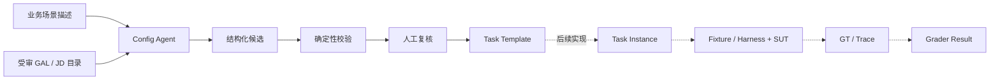

# UAV Benchmark Pipeline

面向 AI 飞手能力评测的任务配置、实例化与证据化评分框架。

本项目研究如何将无人机行业任务描述转化为结构明确、可机器校验、可复现并可扩展的 benchmark artifacts。框架以 GAL（能力与自主等级）描述受测能力边界，以 JD（任务变量）描述场景配置，并显式区分 SUT、Fixture/Harness、外部执行器、Ground Truth 与 Grader 的责任。

当前版本完成了 pipeline 的任务配置生成段：

```text
业务场景描述
  → Config Agent
  → GAL / JD 候选
  → 确定性校验
  → 人工复核与 TBD 补录
  → 自然语言 Task Template
```

Task Instance、Ground Truth、SUT Trace 与 Grader Result 的数据合同已经建立；真实 Fixture/Harness、实例生成器和评分执行链仍属于后续实现范围。

## 研究目标

本项目关注以下工程与评测问题：

1. 如何把非结构化业务需求转换为可审核的任务模板；
2. 如何用 A×L 能力单元描述 SUT 的正式评分边界；
3. 如何将 SUT 能力与外部执行器、飞控和人工决定接口分离；
4. 如何在不编造阈值、业务规则和 simulator 接口的前提下保留 TBD；
5. 如何通过 schema、版本、seed、provenance、GT 与 Trace 支持可复现评测；
6. 如何让多个行业案例共享同一条 pipeline，而不是为每个案例开发独立程序。

## 设计原则

- **能力边界显式化**：只评价任务模板中明确声明的 GAL A×L，不自动推导更高或更低等级。
- **运行责任分离**：SUT 输出、Fixture 注入、外部执行器动作与 Grader 归因分别记录。
- **变量域受审**：Agent 只提取候选；变量允许域、阈值和业务判据必须来自受审配置。
- **未知项可见**：缺失信息进入 TBD 或 Open Question，不静默补值。
- **证据可追溯**：Agent 候选引用原始任务描述；人工确定值必须记录确认依据。
- **结果可复现**：artifact schema、版本、模型标识、运行 ID 与后续 seed 共同描述一次评测运行。

## 系统架构



Config Agent 负责候选生成，不负责批准业务规则。确定性校验与人工复核共同构成模板进入后续运行链之前的质量门。

## 实现状态

| 模块 | 状态 | 说明 |
|---|---|---|
| Config Agent | 已实现 | 查询受审 GAL/JD 子集并生成结构化候选 |
| 自然语言 Task Template | 已实现 | 输出带 `【jd-x.x 字段＝值】` 标注的任务模板 |
| 确定性校验 | 已实现 | 检查目录范围、证据、模板骨架、责任边界与人工来源 |
| 人工复核工作台 | 已实现 | 统一补录 TBD、外部依赖和模板修订，不重复调用模型 |
| YAML Intake Compiler | 已实现 | 将人工填写的案例配置编译为 Task Template JSON |
| Artifact Schemas | 已实现 | 定义 Template、Instance、GT、Trace 和 Grader Result |
| Task Instance Generator | 待实现 | 按受审变量域遍历或基于 seed 采样 |
| Fixture/Harness 与 Mock SUT | 待实现 | 执行阶段机并生成标准 Trace |
| Grader | 待实现 | 基于 GT/Trace 进行能力归因和 task-level gate 判断 |

## 任务模板

当前提供两个共享同一配置 pipeline 的无人机任务模板：

- [模版一：城市高楼峡谷违停车辆巡检](templates/模版一_城市高楼峡谷违停车辆巡检.md)
- [模版二：油田管廊缺陷巡检](templates/模版二_油田管廊缺陷巡检.md)

两个案例用于验证能力边界、JD 提取、外部依赖和 TBD 处理方式，并不构成固定答案库。Config Agent 的受审知识目录不包含案例完整模板。

## 快速开始

### 环境要求

- Python 3.11 或更高版本
- 一个可用的 Gemini API Key（仅 Config Agent 在线生成需要）
- 支持现代 JavaScript 的浏览器

### 安装

```bash
python3 -m venv .venv
source .venv/bin/activate
python -m pip install -e '.[agent,test]'
```

### 启动 Config Agent 演示

```bash
./scripts/start_agent_demo.sh
```

启动脚本会在终端中读取 `GEMINI_API_KEY`。输入不会写入 HTML、运行记录或仓库文件。服务启动后访问：

```text
http://127.0.0.1:8765
```

请通过本地 HTTP 服务打开页面；直接双击 `pipeline.html` 无法访问 Config Agent API。

## 演示流程

1. 输入新的无人机业务描述，或载入案例一/案例二作为示例输入；
2. 运行 Config Agent，获取 GAL A×L、Runtime Dependencies 与 JD 候选；
3. 人工确认正式评分能力与外部运行依赖；
4. 检查 JD 候选、原文证据和 TBD；
5. 查看自然语言 Task Template 与确定性校验问题；
6. 在人工复核工作台统一补录 TBD、外部依赖或模板修订；
7. 保存 Human Revision，并重新执行确定性校验。

人工修订形成独立版本，不覆盖 Agent 原始输出，也不再次消耗模型调用额度。

## 离线任务配置

除 Config Agent 外，项目提供确定性的 YAML Intake Compiler。它适用于人工编写案例配置、CI 校验以及不调用大模型的模板生成。

生成案例二 Task Template：

```bash
PYTHONPATH=src python3 -m uav_benchmark.compiler \
  --input examples/intake/case2_oilfield_intake.yaml \
  --output examples/case2_oilfield_corridor/task_template.generated.json
```

只执行校验：

```bash
PYTHONPATH=src python3 -m uav_benchmark.compiler \
  --input examples/intake/case2_oilfield_intake.yaml \
  --check
```

案例配置方法见 [案例模板编写说明](docs/how_to_create_case_template.md)。

## Artifact Contracts

项目采用 JSON Schema Draft 2020-12 定义跨组件数据合同。

| Artifact | Schema | 作用 |
|---|---|---|
| Task Template | `schemas/task_template.schema.json` | 描述能力边界、JD 插槽、变量域、运行依赖和任务阶段 |
| Task Instance | `schemas/task_instance.schema.json` | 固定变量绑定、seed 与输入版本后的可执行实例 |
| Ground Truth | `schemas/ground_truth.schema.json` | 保存仅 Fixture/Grader 可见的世界真值 |
| SUT Trace | `schemas/sut_trace.schema.json` | 记录 SUT 在运行期间产生的结构化事件与输出 |
| Grader Result | `schemas/grader_result.schema.json` | 输出能力归因、reason code、指标状态和 task-level gate |

合法最小样例位于 `examples/contracts/`。

## 项目结构

```text
pipeline.html                 浏览器演示与人工复核界面
scripts/start_agent_demo.sh   本地服务启动入口
src/uav_benchmark/agent/      Config Agent、校验器与 HTTP 服务
src/uav_benchmark/compiler/   YAML Intake Compiler
knowledge/                    受审 GAL/JD 子集与模板骨架
schemas/                      五类 benchmark artifact schema
examples/                     合同样例、案例 intake 与编译结果
templates/                    自然语言任务模板
tests/                        schema、compiler 与 Agent 合同检查
docs/                         使用说明与代码文档
```

代码模块说明见 [代码梳理](docs/codebase_guide.md)，演示操作见 [Config Agent 演示说明](docs/config_agent_quickstart.md)。

## 验证与复现

运行 schema 与 compiler 测试：

```bash
python -m pytest -q
```

运行 Config Agent 合同检查：

```bash
PYTHONPATH=src .venv/bin/python tests/agent_contract_checks.py
```

正式实验记录应至少保存以下信息：

- Git commit；
- artifact schema 与模板版本；
- Config Agent 模型标识和 Run ID；
- 人工修订版本与确认依据；
- Task Instance seed 和变量绑定；
- Fixture、SUT、GT、Trace 与 Grader 版本。

本地 Agent 运行记录保存在 `.agent_runs/`，默认不纳入 Git。

## 当前局限

- 当前网页只执行到 Task Template 复核阶段，尚未运行真实 SUT 或 simulator；
- 当前 GAL/JD 目录是面向两个演示案例的受审子集，不代表完整能力本体；
- Agent 输出仍需确定性校验和人工确认，不能作为自动批准的业务规则；
- threshold、metric 参数、业务完成判据和 simulator 接口尚未统一标定；
- 当前示例不能替代真实平台、传感器和场景数据上的有效性验证。

## 后续工作

1. 实现受审变量域驱动的 Task Instance Generator；
2. 建立案例一的 Mock Fixture/Harness 与 Mock SUT；
3. 生成可复现的 Ground Truth 与 SUT Trace；
4. 实现按 A×L 归因的 Grader 与安全终态 Gate；
5. 扩展案例库并验证跨场景复用性；
6. 在规则确认后增加真实 simulator 或飞控适配层。
