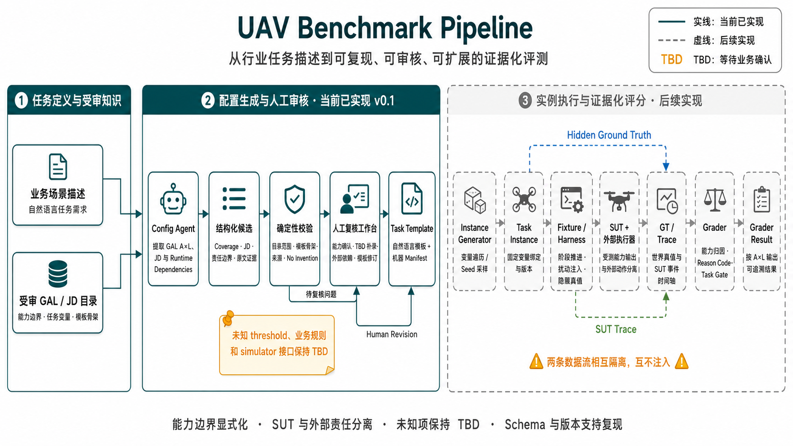

# UAV Benchmark Pipeline

面向 AI 飞手能力评测的任务配置、实例化与证据化评分框架。

本项目研究如何将无人机行业任务描述转化为结构明确、可机器校验、可复现并可扩展的 benchmark artifacts。框架以 GAL（能力与自主等级）描述受测能力边界，以 JD（任务变量）描述场景配置，并显式区分 SUT、Fixture/Harness、外部执行器、Ground Truth 与 Grader 的责任。

当前网页演示按五步完成配置到具体化：

```text
STEP 1  任务域选择      任务描述 + 可选场景示例
STEP 2  文案与 A×L      选目标 Coverage → 扩充文案 → 分类
STEP 3  JD 域提取       按 A 查看变量域
STEP 4  任务域模版      为每个 JD 选 fixed / enum / range / TBD
STEP 5  特定任务模版    Seed → 具体 JD 值（可复现）
```

产品命名：STEP 4 产出**任务域模版**（取值域）；STEP 5 用 Seed 抽样得到**特定任务模版**。  
Wire 合同里特定任务模版仍用 `task_instance` schema。真实 SUT / simulator / GT / Grader 尚未接入页面。

## 研究目标

本项目关注以下工程与评测问题：

1. 如何把非结构化业务需求转换为可审核的任务模板；
2. 如何用 A×L 能力单元描述 SUT 的正式评分边界；
3. 如何将 SUT 能力与外部执行器、飞控和人工决定接口分离；
4. 如何在不编造阈值、业务规则和 simulator 接口的前提下保留 TBD；
5. 如何通过 schema、版本、seed、provenance、GT 与 Trace 支持可复现评测；
6. 如何让多个行业案例共享同一条 pipeline，而不是为每个案例开发独立程序。

## 设计原则

- **能力边界显式化**：只评价任务模板中明确声明的 GAL A×L；等级责任按 L1 到目标等级累计，不自动升级到更高等级。
- **运行责任分离**：SUT 输出、Fixture 注入、外部执行器动作与 Grader 归因分别记录。
- **变量域受审**：Agent 只提取候选；变量允许域、阈值和业务判据必须来自受审配置。
- **未知项可见**：缺失信息进入 TBD 或 Open Question，不静默补值。
- **证据可追溯**：任务候选引用人工确认稿，场景固定值引用版本化场景来源；人工确定值必须记录确认依据。
- **结果可复现**：artifact schema、版本、模型标识、运行 ID 与后续 seed 共同描述一次评测运行。

## 系统架构



Config Agent 负责候选生成，不负责批准业务规则。确定性校验与人工复核共同构成模板进入后续运行链之前的质量门。
架构图中的 Config Agent 在当前网页中实现为两个处理阶段：先生成可编辑业务文案，再对人工确认稿进行能力分类与变量提取；后一个阶段内部将 coverage 与 JD/dependency extraction 分开执行。

## 实现状态（网页已有）

| 能力 | 说明 |
|---|---|
| 五步 Pipeline UI | `pipeline.html` + `pipeline/` 模块；侧栏可选 DeepSeek / Gemini |
| 目标 Coverage | STEP 2 选 A×L（含 Seed 随机）；再扩充文案并分类 |
| JD 域与任务域模版 | STEP 3 查看域；STEP 4 编辑 fixed/enum/range/TBD，可智能填 TBD |
| 特定任务模版 | STEP 5：单个 / 随机一批 / 批量范围 / 全遍历；卡片分用户侧·世界侧 |
| 进度保存 | 浏览器自动暂存；手动「保存/加载」检查点；「重新开始」不清检查点 |
| Config Agent API | 文案扩充、A×L/JD 提取、fill-tbd、任务模版生成 |
| 离线 compiler / schemas | YAML intake、artifact schema（见下文）；GT/SUT/Grader 未接页面 |

## 任务模板

业务场景注册表提供高速巡检、油气巡检、桥梁巡检、园区巡检和其他巡检示例。它们是可选语境，不是必须先锁定的专用 pipeline。机读配置见 [business_scenario_registry.json](knowledge/business_scenario_registry.json)。以下案例材料保留为任务设计与验证参考：

- [模版一：城市高楼峡谷违停车辆巡检](templates/模版一_城市高楼峡谷违停车辆巡检.md)
- [模版二：油田管廊缺陷巡检](templates/模版二_油田管廊缺陷巡检.md)

场景注册表描述 Summary、固定边界、可选任务模块、JD 绑定方式和外部依赖，不是预先填好的 A×L 答案。能力等级来自人工任务描述，经 Agent 提议后再由人确认。Config Agent 的通用受审知识目录不包含案例完整答案。

## 快速开始

### 环境要求

- Python 3.11 或更高版本
- 一个可用的 Gemini 或 DeepSeek API Key（仅 Config Agent 在线生成需要）
- 支持现代 JavaScript 的浏览器

### 安装

```bash
python3 -m venv .venv
source .venv/bin/activate
python -m pip install -e '.[agent,test]'
```

### 启动 Config Agent 演示

```bash
./scripts/start_agent_demo.sh
```

启动脚本从本地环境或 `.env` 读取 `GEMINI_API_KEY` 和/或 `DEEPSEEK_API_KEY`。Key 不会进入 HTML、运行记录或仓库文件。服务启动后访问：

```text
http://127.0.0.1:8765
```

请通过本地 HTTP 服务打开页面；直接双击 `pipeline.html` 无法访问 Config Agent API。

## 演示流程

1. **STEP 1**：写任务描述（可选加载场景示例）→ 确认；
2. **STEP 2**：选目标 A×L（可按 Seed 随机）→ 确认并扩充文案 → 确认文案并分类；
3. **STEP 3**：查看按 A 分组的 JD 变量域 → 确认；
4. **STEP 4**：编辑取值域；TBD 可智能填写 → 确认；
5. **STEP 5**：选 Seed 生成特定任务模版；重点看每个实例的具体 JD 值。

每步可「保存/加载」。操作细节见 [Config Agent 演示说明](docs/config_agent_quickstart.md)；完整流程见 [Pipeline UI 操作流程](docs/pipeline_ui_walkthrough.md)。

## 离线任务配置

除 Config Agent 外，项目提供确定性的 YAML Intake Compiler。它适用于人工编写案例配置、CI 校验以及不调用大模型的模板生成。

生成案例二 Task Template：

```bash
PYTHONPATH=src python3 -m uav_benchmark.compiler \
  --input examples/intake/case2_oilfield_intake.yaml \
  --output examples/case2_oilfield_corridor/task_template.generated.json
```

只执行校验：

```bash
PYTHONPATH=src python3 -m uav_benchmark.compiler \
  --input examples/intake/case2_oilfield_intake.yaml \
  --check
```

案例配置方法见 [案例模板编写说明](docs/how_to_create_case_template.md)。

## Artifact Contracts

项目采用 JSON Schema Draft 2020-12 定义跨组件数据合同。

| Artifact / 产品名 | Schema | 作用 |
|---|---|---|
| Domain / 完整模板 | `schemas/task_template.schema.json` | 能力边界、JD 域、依赖与阶段（离线 compiler 完整形态） |
| 特定任务模版（STEP 5） | `schemas/task_instance.schema.json` | Seed 具体化后的 JD 槽位绑定（wire：`task_instance`） |
| Ground Truth | `schemas/ground_truth.schema.json` | 仅 Fixture/Grader 可见的世界真值 |
| SUT Trace | `schemas/sut_trace.schema.json` | SUT 运行期间的结构化事件与输出 |
| Grader Result | `schemas/grader_result.schema.json` | 能力归因、reason code、指标状态和 task-level gate |

合法最小样例位于 `examples/contracts/`。

## 项目结构

```text
pipeline.html                 浏览器演示入口（薄壳）
pipeline/                     UI 模块：css/app.css + js/*.js（见 pipeline/README.md）
JD业务变量树_version1.html    JD 变量树可分享单文件
jd-variable-tree/             变量树构建所需的页面逻辑与样式
scripts/start_agent_demo.sh   本地服务启动入口
src/uav_benchmark/agent/      Config Agent、校验器与 HTTP 服务
src/uav_benchmark/compiler/   YAML Intake Compiler
knowledge/                    全量 A×L/JD 机读目录、构建报告与模板骨架
schemas/                      五类 benchmark artifact schema
examples/                     合同样例、案例 intake 与编译结果
templates/                    自然语言任务模板
tests/                        schema、compiler 与 Agent 合同检查
docs/                         使用说明、G1 设计与 JD 变量树文档
```

完整入口见 [文档索引](docs/README.md)，代码模块说明见 [代码梳理](docs/codebase_guide.md)。

## 验证与复现

运行 schema 与 compiler 测试：

```bash
python -m pytest -q
```

运行 Config Agent 合同检查：

```bash
PYTHONPATH=src .venv/bin/python tests/agent_contract_checks.py
```

正式实验记录应至少保存以下信息：

- Git commit；
- artifact schema 与模板版本；
- Config Agent 模型标识和 Run ID；
- 人工修订版本与确认依据；
- 特定任务模版（STEP 5）的 seed 和 JD 变量绑定；
- Fixture、SUT、GT、Trace 与 Grader 版本。

本地 Agent 运行记录保存在 `.agent_runs/`，默认不纳入 Git。

受审知识目录可从两份人读/机读 Markdown 字典确定性重建：

```bash
.venv/bin/python scripts/build_knowledge_catalog.py
```

构建过程校验 17 个 A、68 个 A×L、66 个 JD、累计继承关系、ID 唯一性和全部 JD 交叉引用，并保存源文件 SHA-256。运行产物同时记录 A×L 与 JD 字典的 `schema_version`。

## 当前局限

- 当前网页只执行到特定任务模版阶段，尚未运行真实 SUT 或 simulator；
- 五类场景目前来自需求级 Summary 和变量域，还需要业务负责人逐项确认对象 taxonomy、接口、阈值和完成规则；
- 当前受审字典覆盖 17 个 A、68 个 A×L1–L4 单元和 66 个 JD，但不包含 L5/L6 的逐 A 责任定义；
- 早期白墙草案中的 `jd-8.1/8.2/8.3` 与当前 `jd-11.1/11.2/11.3` 语义不同，现作为 `PROPOSED` 非 canonical 候选保留，构建报告显式记录冲突；
- Agent 输出仍需确定性校验和人工确认，不能作为自动批准的业务规则；
- threshold、metric 参数、业务完成判据和 simulator 接口尚未统一标定；
- 当前示例不能替代真实平台、传感器和场景数据上的有效性验证。

## 后续工作

1. 把任务域模版提升为完整 `task_template.schema.json`（含正式 coverage/interfaces）；
2. 建立案例一的 Mock Fixture/Harness 与 Mock SUT；
3. 生成可复现的 Ground Truth 与 SUT Trace；
4. 实现按 A×L 归因的 Grader 与安全终态 Gate；
5. 使用五类场景的真实任务输入验证跨场景复用性；
6. 在规则确认后增加真实 simulator 或飞控适配层。
